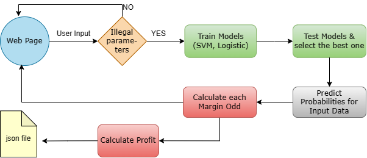

  

# Betting Website

## Content

- [Overview](#Overview)
- [Introduction](#introduction)
  - [Dataset](#Dataset)
  - [Tools](#Tools)
  - [Process diagram](#Process diagram)
  - [How to use](#How to use)
- [Features](#features)
- [How to use](#How to use)
- [Further Work](#Further Work)
- [Contact](#Contact)

## Overview
According to previous years' results of matches, train models based on the dataset, and predict the winning probability for each team by the well-trained models, and further calculate the corresponding odds to ensure that the company could get about 5 cent profit in each match.

## Introduction
#### Dataset
 Data Website:  <https://datahub.io/sports-data/english-premier-league>\
 I used the data from 2009 to 2018 of english-premier-league, about 400,000 records in total. \
 **Used columns**: HomeTeam, AwayTeam, FTHG, FTAG, FTR, HTHG, HTAG, HS, AS, HST, AST, HY, AY, HR, AR.\
 Training data: 75%,  test data: 25%
 
#### Tools
 - Python3.11 
 - Main packages:  sklearn, PyWebIo, Numpy, Pandas

#### Process diagram

#### How to use

##  Features
 - SVM
 - Logistic Regression
 - Gaussian distribution
 
 
## Further Work
- Using a real-time API for dataset instead of download data files.
- Using more comprehensive datasets, like the ranks for players, weather data, etc.
- Training more complex models and use more different algorithms.
Features

## Contact
 - TongSun - [tong.sun@ucdconnect.ie](tong.sun@ucdconnect.ie)
 