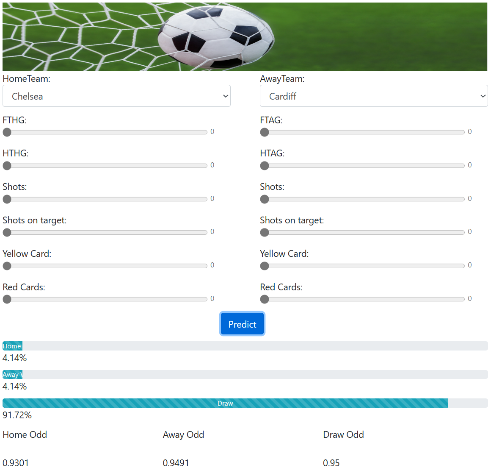

<p align="center">
  
</p>

# Betting Website

## Content
- [Overview](#Overview)
- [Introduction](#introduction)
  - [Dataset](#Dataset)
  - [Tools](#Tools)
  - [Process diagram](#Process diagram)
  - [How to use](#How to use)
- [Features](#features)
- [How to use](#How to use)
- [Further Work](#Further Work)
- [Contact](#Contact)

## Overview
According to previous years' results of matches, train models based on the dataset, and predict the winning probability for each team by the well-trained models, and further calculate the corresponding odds to ensure that the company could get about 5 cent profit in each match.

## Introduction
### Dataset
 Data Website:  <https://datahub.io/sports-data/english-premier-league>\
 I used the data from 2009 to 2018 of english-premier-league, about 400,000 records in total. \
 **Used columns**: HomeTeam, AwayTeam, FTHG, FTAG, FTR, HTHG, HTAG, HS, AS, HST, AST, HY, AY, HR, AR.\
 Training data: 75%,  test data: 25%
 
 
### Tools
 - 
 - 
 
 
### Process diagram
 
 
 
### How to use
#### Installation
**Download project:** \
``` git clone https://github.com/ACM40960/project-TongSun```

**Packages:** \
```python
import yaml
import numpy as np
import json
import os
from time import time
import pandas as pd
from sklearn.linear_model import LogisticRegression
from sklearn.svm import SVC
from sklearn.model_selection import train_test_split
from sklearn.preprocessing import LabelEncoder, MinMaxScaler
import pywebio.pin as pin
from pywebio.output import *
from pywebio import start_server
```
#### Get start
Run `app.py` under the `algorithms` folder, you can config any port you like in the `main`  function,  you can find the link on the console, eg, my link is: http://192.168.99.195:8080/, visit this link in your browser, you will see the following page, then choose any data you like and you can get the predict data, also you can see the accuracy and runtime of each model on the console.



##  Features
 - SVM
 - Logistic Regression
 - PyWebIo
 
## Further Work
- Using a real-time API for dataset instead of download data files.
- Using more comprehensive datasets, like the ranks for players, weather data, etc.
- Training more complex models and use more different algorithms.
Features

## Contact
 - TongSun - [tong.sun@ucdconnect.ie](tong.sun@ucdconnect.ie)
 